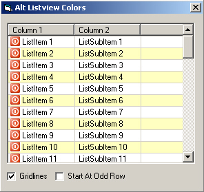



## Alternate Listview Row Colors

### Description

This is a small example showing how to alternate row colors in a listview. Very basic...very simple!

Please comment and rate, I am looking forward to reading your thoughts.

Thanks
 
### More Info
 

             |
---                |---
**Submitted On**   |2005-04-09 18:34:00
**By**             |[Bugzy](https://github.com/Planet-Source-Code/PSCIndex/blob/master/ByAuthor/bugzy.md)
**Level**          |Beginner
**User Rating**    |4.9 (117 globes from 24 users)
**Compatibility**  |VB 3\.0, VB 4\.0 \(16\-bit\), VB 4\.0 \(32\-bit\), VB 5\.0, VB 6\.0
**Category**       |[Miscellaneous](https://github.com/Planet-Source-Code/PSCIndex/blob/master/ByCategory/miscellaneous__1-1.md)
**World**          |[Visual Basic](https://github.com/Planet-Source-Code/PSCIndex/blob/master/ByWorld/visual-basic.md)
**Archive File**   |[Alternate\_187468492005\.zip](https://github.com/Planet-Source-Code/bugzy-alternate-listview-row-colors__1-51229/archive/master.zip)

